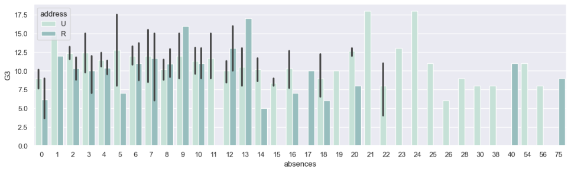
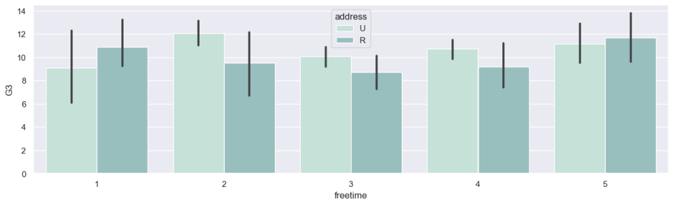
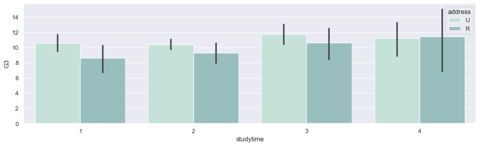
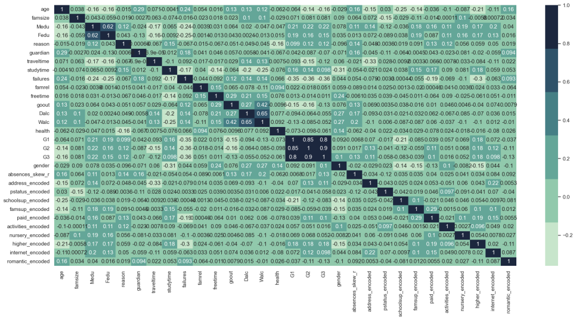
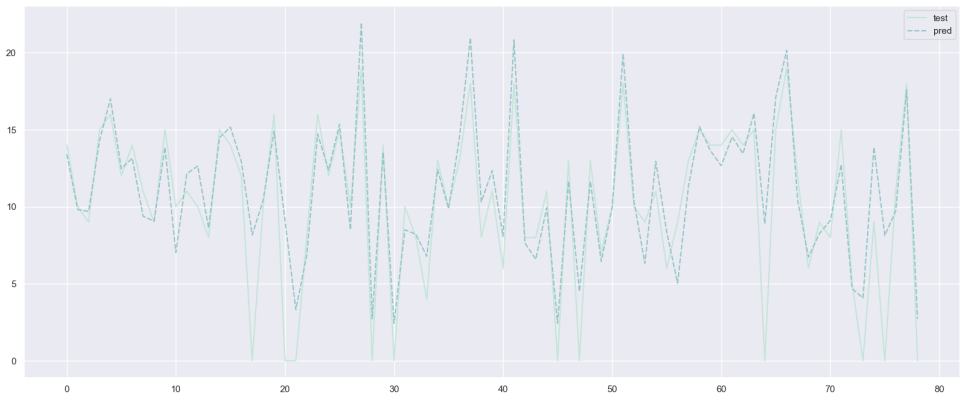

# Student Performance Dataset EDA and ANN model creation

### Data Source 
1. [Student Performance](https://www.kaggle.com/datasets/whenamancodes/student-performance)

### kaggle notebook
1. [Kaggle Notebook](https://www.kaggle.com/code/biswajit01/student-performance-prediction/notebook)

### Software & Tools Requirement

1. [Github Account](https://github.com)
2. [VSCode IDE](https://code.visualstudio.com)
3. [Git CLI](https://git-scm.com/downloads)
4. [Heroku](https://www.heroku.com)
### 개발 일지
1. [https://blog.naver.com/rngustmd0719/222907246265](https://blog.naver.com/rngustmd0719/222907246265)
2. [https://blog.naver.com/rngustmd0719/222907403000](https://blog.naver.com/rngustmd0719/222907403000)

Create a new environment

```  
    conda create -p venv python==3.9 -y
```
Activate the environment

``` 
    conda activate ./venv
```


Command to run the flask app 

```
    python app.py
```
# student-performance-predict

tesorflow와 keras를 이용한 인공지능 학습







